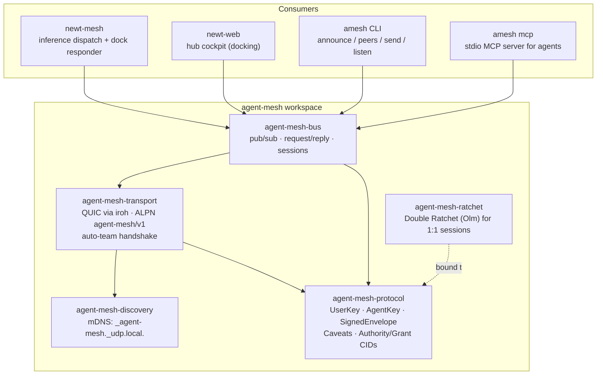
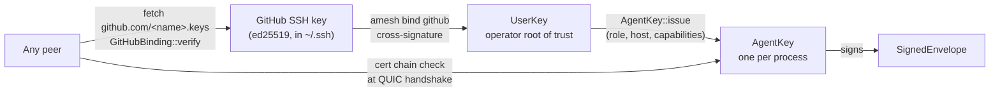
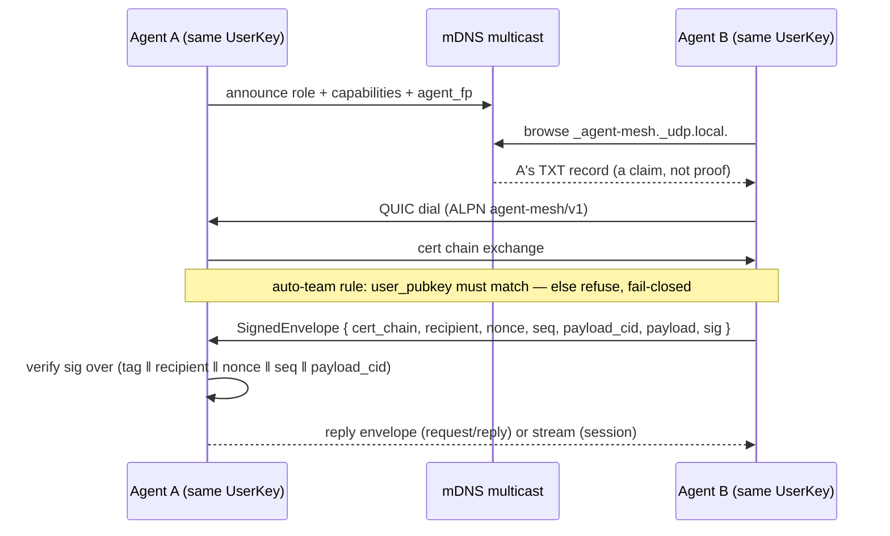
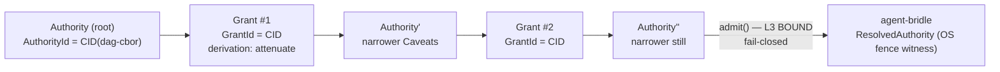
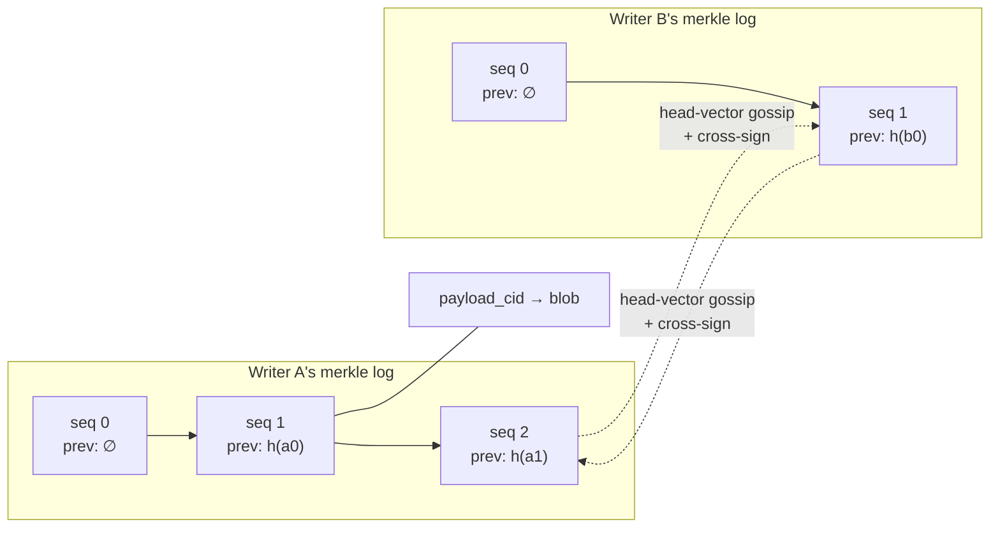
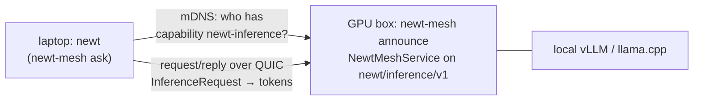
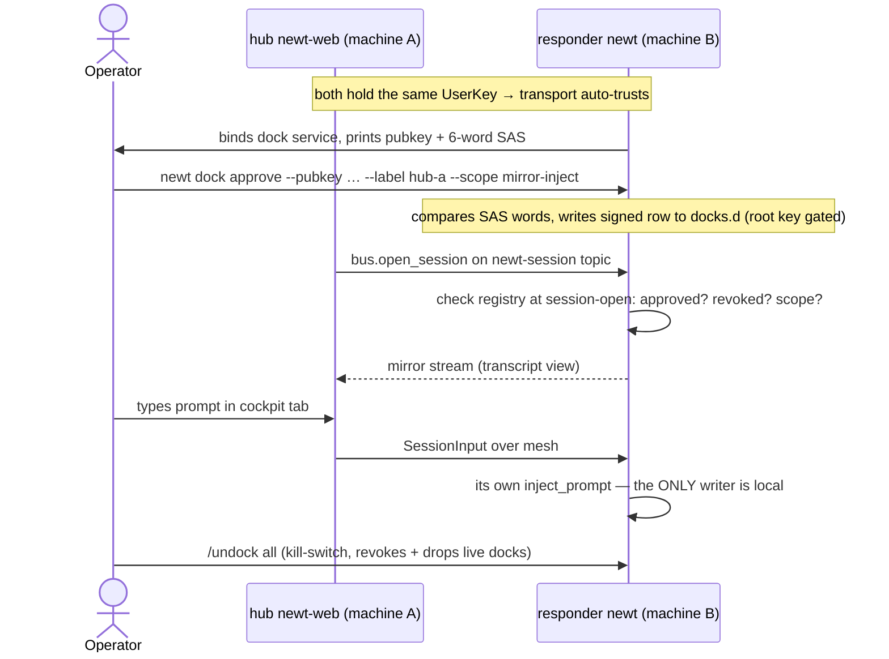
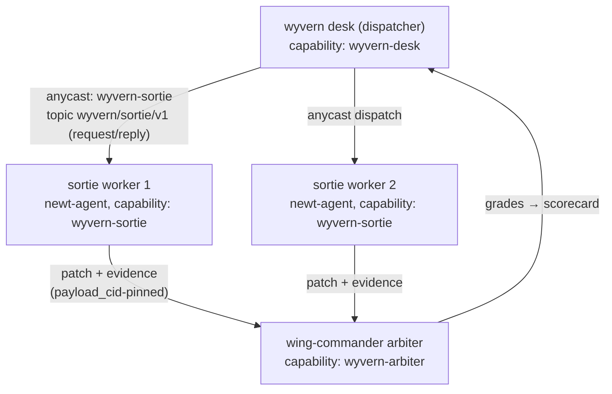

# agent-mesh Field Guide

What the mesh is, where the keys and CIDs live, and how to wire **newt-agent**
and **wyvern-agent** into it — as built on `main 5ff8f3f`, 2026-08-13.

| | |
|---|---|
| **Repo** | Gilamonster-Foundation/agent-mesh |
| **CLI** | `amesh` (`cargo install agent-mesh-cli`) |
| **Crates.io** | `agent-mesh-protocol 0.6.4` + discovery / transport / bus |
| **Python** | `pip install newt-agent-mesh` → `import agent_mesh` |

Status markers used throughout: **TODAY** = shipped and working on `main`;
**PLANNED** = designed (ADR exists) but not built.

## 1 · The shape of it — a broker-less, cryptographic bus in four layers

agent-mesh is what tmux-message-bus is *for* — letting independent agents
coordinate — but built on a different foundation: instead of a shared SQLite
file and tmux-session identity on one machine, every message is **signed by an
ed25519 agent key**, peers find each other over **mDNS on the LAN**, and the
pipe between them is **authenticated QUIC** (iroh). No broker, no daemon, no
copied tokens: each process binds its own endpoint, and trust comes from the
key chain, not the location.



*The workspace. Everything above the line consumes the bus; everything below is
the published library stack. `agent-mesh-py` wraps the same layers for Python.*

## 2 · Root of trust — your GitHub SSH key vouches for everything

The identity model is a three-link chain. A **UserKey** (ed25519) is the
operator's root; it is cross-signed by the ed25519 SSH key GitHub already knows
(`amesh bind github`), so any peer can verify "this mesh user is the person
behind `github.com/<name>`" by fetching `https://github.com/<name>.keys` — no
CA, no token exchange. The UserKey then issues per-process **AgentKeys**; the
AgentKey signs every envelope. Fingerprints are BLAKE3 of the pubkey, and the
agent's fingerprint doubles as its iroh endpoint ID — knowing who someone is
*is* knowing how to dial them.



*The trust chain. Verification needs only public information: the peer's cert
chain and GitHub's published keys.*

The transport enforces the **auto-team rule** fail-closed: at the QUIC
handshake, if the peer's `user_pubkey` differs from yours and no pact exists,
the connection is refused before any payload crosses. Two agents you started on
two machines with the same UserKey trust each other automatically; everyone
else is refused.

> [!WARNING]
> **Known residual (pre-existing, tracked):** the handshake checks the Hello
> cert's user fingerprint without proof-of-possession and doesn't bind the cert
> to `conn.remote_id()` — a harvested same-operator cert could pass the
> auto-team gate. The dock layer (§6) is independently fail-closed against this
> via its per-AgentKey registry, but the body-only inference responder serves
> any same-operator peer. Treat the auto-team gate as a filter, not a proof.

## 3 · On the wire — signed envelopes, CID-pinned payloads

Every message is a `SignedEnvelope`: the sender's cert chain, an addressing tag
(`Direct` to a fingerprint, `Topic` in the user's namespace, or `Anycast` to a
capability), a nonce, a per-session sequence number, the payload, and — this is
where content addressing starts — a **`payload_cid`: the BLAKE3 hash of the
payload, under the signature**. Tamper with a byte and `verify()` fails.



*Discovery is unauthenticated hints; authentication happens at the handshake;
integrity happens per-envelope.*

The bus gives three exchange shapes on top: **publish/subscribe** on topics,
**request/reply** (one-shot), and **sessions** — a held-open bidirectional
stream of envelopes (the [session_streams ADR](decisions/session_streams.md);
this is what docking rides). Since #75, a responder can demand a
**verified-caller `RequestContext`**: the envelope's signer is bound to the
QUIC session identity, so "who is asking" is transport-authenticated, not
self-declared.

## 4 · CIDs & merkle trees — what's real today, what's designed

### **TODAY** — authority provenance is a CID DAG

As of `0.6.4`, the protocol crate carries **content-addressed authority
provenance** — supply-chain-security techniques applied to the provenance of
*authority* rather than artifacts. An `Authority` (a `Caveats` bundle) and a
`Grant` (a derivation from a parent authority) are hashed in domain-tagged
dag-cbor canonical form into typed CIDs (`AuthorityId`, `GrantId`). A grant
names its parent by CID, so attenuation chains form a tamper-evident DAG — the
merkle-tree bones of the design. Four proofs are kept deliberately distinct:

| Proof | Mechanism | Answers |
|---|---|---|
| Identity | `AuthorityId` / `GrantId` (CID) | is this the exact object? |
| Assertion | signature (deferred) | who vouched for it? |
| Authorization | attenuation algebra (`check_derivation`) | is this derivation legal? |
| Enforcement | platform witness (agent-bridle) | what did the OS enforce? |



*The authority DAG. Each hop is CID-linked and checked by the attenuation
algebra; a widened grant has no legal derivation. agent-bridle consumes this
exact crate (its `Caveats` leash is this `Caveats`).*

### **PLANNED** — the store: per-writer merkle logs

The message-history merkle tree lives in the
[agent-mesh-store ADR](decisions/agent_mesh_store.md) (2026-06-10, RFC — *no
code yet*). Its model: every agent's contributions to a shared board form an
**append-only, hash-chained, signed log** — each entry carries `seq`, `prev`
(BLAKE3 of the writer's previous entry), and a `payload_cid` for the body.
Replicas reconcile by gossiping head vectors and cross-signing each other's
heads. This is the piece that would give the mesh what tmux-message-bus's
SQLite file gives it — durable, offline-tolerant delivery — with cryptographic
tamper-evidence instead of file permissions.



*The proposed store: each writer is its own clock and its own merkle log;
reconciliation is gossip + cross-signatures, no central database.*

## 5 · agent-mesh vs. tmux-message-bus

They solve overlapping problems with opposite trade-offs. tmux-message-bus is a
*durable single-host inbox*: SQLite-WAL delivery, identity from tmux session
anchors, an optional `send-keys` doorbell — its killer feature is that agents
need not be alive at the same time. agent-mesh is a *live cryptographic LAN
fabric*: real keys, real transport auth, cross-machine reach — but **no durable
inbox yet** (that's the store ADR above). Today the mesh assumes both peers are
up.

| | tmux-message-bus | agent-mesh |
|---|---|---|
| Transport | shared SQLite WAL file | QUIC (iroh), mDNS discovery |
| Identity | tmux session anchor | ed25519 chain: GitHub SSH → UserKey → AgentKey |
| Integrity | file permissions | per-envelope signatures + BLAKE3 `payload_cid` |
| Reach | one machine | LAN (mDNS) or direct-dial `--addr` across WAN/WireGuard |
| Offline delivery | **yes** — durable rows, drain later | not yet — store ADR is designed, unbuilt |
| Wake-up | tmux send-keys doorbell | live QUIC push (sessions) |
| Trust boundary | same user account on one box | same UserKey across machines, fail-closed handshake |

> [!NOTE]
> **The honest gap:** if what you love about tmux-message-bus is `bus drain` —
> messages waiting for an agent that wasn't running — the mesh doesn't do that
> today. The path to it is implementing `agent-mesh-store`; its ADR already
> commits to the model (signed per-writer merkle logs, head-vector gossip,
> cross-sign reconciliation).

## 6 · newt-agent, today — inference dispatch and docking

newt-agent already rides the mesh in production shape, through the
(deliberately workspace-excluded) `newt-mesh` crate. Both flows assume all
machines share one operator UserKey (`~/.newt/identity.pem`).

### Flow 1 — LAN inference dispatch (**TODAY**)

A box with a big model binds a responder on topic `newt/inference/v1` and
announces the `newt-inference` capability; any same-user newt on the LAN
discovers it and asks. This is how a laptop borrows the GPU box without any
endpoint configuration.



*Inference dispatch: capability-tagged discovery, then authenticated
request/reply. The payload schema is newt's; the mesh carries it verbatim.*

### Flow 2 — Docking: a hub cockpit for remote sessions (**TODAY**)

Landed 2026-08-12 (newt-agent #1643 + agent-mesh #75): a hub `newt-web`
surfaces *another machine's* newt sessions in its cockpit. The security shape
is the interesting part — authorization lives at the **resource-owning
responder**, not the hub, and the hub never writes a remote transcript: it
mirrors the view and enqueues prompts through the remote host's own inject seam
(single-writer preserved across the network). Approval is a signed, revocable
registry row in `~/.newt/ocap/docks.d/peers.toml`, gated by a 6-word SAS
ceremony compared across terminals.



*Docking. The dock grant is a **location-scoped bearer record**: writing
`docks.d` requires possessing the operator root key on that machine, so the
registry boundary **is** the trust boundary.*

| Command | Does |
|---|---|
| `newt dock approve --pubkey HEX --label NAME --scope mirror\|mirror-inject` | SAS-compare, then write a signed approval (least authority: `mirror` default) |
| `newt dock list` | show live approvals (read-only) |
| `newt dock revoke PEER` / `revoke-all` | re-sign with bumped generation — drops *live* docks, not just future ones |

## 7 · wyvern-agent, today — intends to ride the mesh; doesn't yet

Honesty first: **wyvern-agent has no mesh code today.** It's at v0.1 ("flight
tier" — the lightest headless worker + `wyvern-runtime`, the stripped agentic
loop). Its README commits to the position — wyvern *rides agent-mesh for
coordination* and *dispatches newt-agent instances as workers* — and its
migration backlog routes the swarm trust-root design into agent-mesh. So
"getting it to work today" means one of two things:

**(a) Drive it from outside, now.** Any wyvern worker process can be a mesh
peer without new Rust: run `amesh mcp` (a stdio MCP server exposing
`mesh_whoami` / `mesh_peers` / `mesh_request`) inside the worker's agent, or
use the Python bindings. This is exactly what `amesh mcp` was built for —
agents driving the mesh without writing bus client code.

**(b) Wire it in properly.** The pattern to copy is `newt-mesh`: a small
excluded crate that binds a `Bus`, registers a request handler on a versioned
topic, and announces a capability tag. For wyvern the natural shape is the desk
dispatching sorties over the mesh (**PLANNED** — proposed wiring, not built):



*The drake-swarm roles mapped onto existing mesh primitives: anycast to a
capability for dispatch, request/reply for sorties, CID-pinned payloads for the
patch evidence. Every box is a same-UserKey AgentKey; agent-bridle leashes each
worker locally.*

## 8 · Runbook — from zero to two talking agents

```sh
# 0. Install the CLI (binary lands as `amesh`)
cargo install agent-mesh-cli

# 1. Root of trust: one UserKey per operator, cross-signed by your GitHub SSH key
amesh keygen
amesh bind github
amesh whoami

# 2. Terminal A — be discoverable AND reachable (binds QUIC + announces on mDNS)
amesh listen --duration 60s
#   prints: listening on udp/<port>, agent_fp=…, user_fp=…

# 3. Terminal B — same user: resolve over mDNS and send a signed envelope
amesh peers --listen 5s --same-user
amesh send <agent-fp-from-A> --payload '{"hello":"world"}'
#   different UserKey? the handshake refuses: auto-team check failed

# 4. newt-agent: serve inference to your LAN, ask from anywhere (same user)
newt-mesh announce          # on the GPU box: binds newt/inference/v1
newt-mesh ask "…prompt…"    # from any same-user peer

# 5. newt-agent: dock a remote newt into your hub cockpit
newt dock approve --pubkey <peer-hex> --label laptop-b --scope mirror
newt dock list
newt dock revoke-all        # the kill-switch

# 6. Give any MCP-capable agent (Claude Code, a wyvern worker) mesh hands
amesh mcp                   # stdio MCP: mesh_whoami · mesh_peers · mesh_request
```

---

*Sources: agent-mesh README + `docs/decisions/` (session_streams,
agent_mesh_store, bus_vs_nats),
`agent-mesh-protocol/src/{envelope,authority,github_binding}.rs`, newt-agent
`docs/decisions/newt_web_docking.md` + `newt-cli/src/dock_cmd.rs` (origin/main
`855d22e6`), wyvern-agent README + MIGRATION_BACKLOG (v0.1), tmux-message-bus
README (fetched 2026-08-13). Diagrams reflect code as of agent-mesh `5ff8f3f`.*
